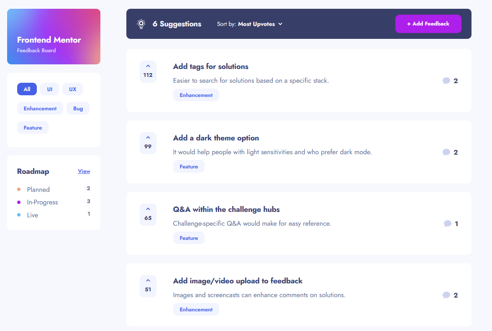

# Product Feedback App

## Tech Stack

- Semantic HTML5 markup
- CSS
- Flexbox
- Typescript
- React
- Tailwind

## Code Formatting and Linting

### Prettier

We used Prettier for our code formatting. It helps to format the code and making it consistent throughout the whole project.

### Eslint

For linting we used ESlint. It helped us catch errors in the code and uphold the teams typescript standards. Our Eslint file
follows common rules for this kind of project.

## Live Demo

Explore the live demo of the Product Feedback App [here](https://ralfislask.github.io/Product-Feedback-App/).

## Status

This project is marked as "In Progress."

## Getting Started

To run the Product Feedback App on your local machine, follow these steps:

1. Download or clone the repository.
2. Install the necessary dependencies and node_moduls by running `npm install`.
3. Start the application using `npm start` (Create React App).

## Description

Product Feedback App that lets you create suggestions in a feedback board. These can then be moved to different categories including planned, in-progress and live. The user can then view this in a roadmap.

## Features

- Filter suggestions by categories.
- Sort by upvotes or comments.
- Users can create new feedback including title, category and details.
- Users can edit feedbacks.
- Users can create and reply to comments on each feature.
- Users can upvote.
- Displays amount of current suggestions.

## Author

- Github: [@RalfiSlask](https://github.com/RalfiSlask).
- Frontend Mentor: [@RalfiSlask](https://www.frontendmentor.io/profile/RalfiSlask).
